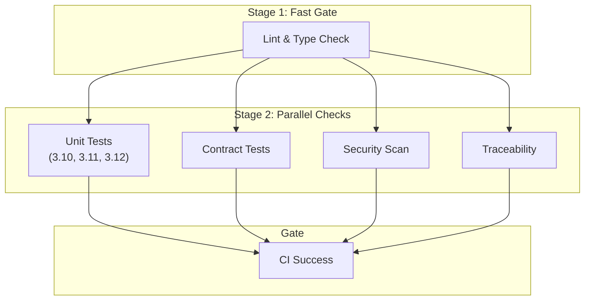
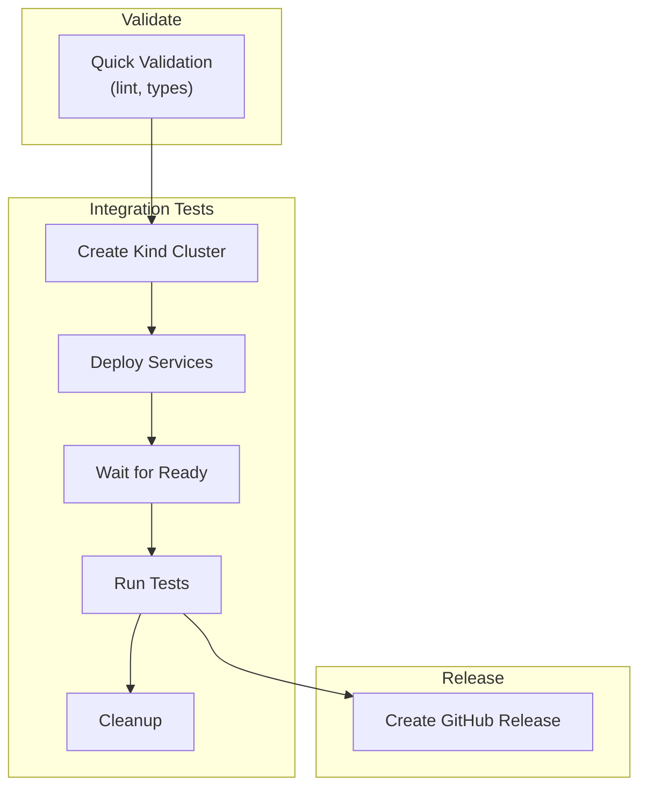

# CI/CD Pipelines

floe uses three GitHub Actions workflows optimized for speed and reliability.

---

## Quick Reference

| Trigger | Workflow | Duration | What Runs |
|---------|----------|----------|-----------|
| **PR / Push to main** | `ci.yml` | ~3 min | Lint, type check, unit tests, contract tests, security |
| **Tag v\*.\*.\*** | `release.yml` | ~15 min | Validate, integration tests (K8s), GitHub Release |
| **2am UTC daily** | `nightly.yml` | ~10 min | Integration tests (K8s), dependency audit |

**Why this split?**
- PRs get fast feedback (~3 min) for quick iteration
- Integration tests (requiring K8s cluster) run on releases and nightly
- Dependency vulnerabilities are caught within 24 hours

---

## PR Pipeline (`ci.yml`)

Fast checks that run on every PR and push to main.



### Jobs

| Job | Purpose | Speed |
|-----|---------|-------|
| **lint-typecheck** | ruff + mypy --strict | ~30s |
| **security** | bandit + pip-audit | ~30s |
| **unit-tests** | pytest across Python versions | ~60s |
| **contract-tests** | Cross-package schema validation | ~20s |
| **traceability** | Requirement marker coverage | ~10s |

---

## Release Pipeline (`release.yml`)

Runs on version tags (e.g., `v0.1.0`) and validates before publishing.



### Triggering a Release

```bash
# Tag with semantic version
git tag v0.1.0
git push origin v0.1.0
```

The release workflow will:
1. Validate code (lint, type check)
2. Run integration tests in K8s (Kind cluster)
3. Create GitHub Release with auto-generated notes

---

## Nightly Pipeline (`nightly.yml`)

Scheduled at 2am UTC to catch regressions and vulnerabilities.

### Jobs

| Job | Purpose |
|-----|---------|
| **integration-tests** | Full integration test suite in K8s |
| **dependency-audit** | pip-audit for CVEs, stale dependency check |
| **notify-failure** | Creates GitHub issue on failure |

### Manual Trigger

```bash
# Run nightly pipeline manually
gh workflow run nightly.yml
```

---

## Local Development

### Install Git Hooks

```bash
# Install git hooks (pre-commit + Cognee) - run once after cloning
make setup-hooks
```

> **Note**: This installs hooks for pre-commit code quality checks and Cognee knowledge sync.
> Run again after `pre-commit install` to restore hooks.

### What Runs Locally

| Hook | When | Checks |
|------|------|--------|
| **Pre-commit** | `git commit` | ruff, formatting, bandit, yaml |
| **Pre-push** | `git push` | mypy --strict, unit tests |

### Reproduce CI Locally

```bash
# Full CI check
make check

# Or manually:
uv run ruff check .
uv run ruff format --check .
uv run mypy --strict packages/ testing/
uv run pytest packages/*/tests/unit/ -v
uv run pytest tests/contract/ -v
```

---

## Troubleshooting

### PR CI Failures

| Symptom | Fix |
|---------|-----|
| **ruff check failed** | `uv run ruff check --fix .` |
| **ruff format failed** | `uv run ruff format .` |
| **mypy failed** | Fix type errors shown in output |
| **Unit tests failed** | Run locally: `make test-unit` |
| **Contract tests failed** | Check `tests/contract/` for schema changes |

### Integration Test Failures

Integration tests run in K8s (Kind cluster). Common issues:

| Symptom | Cause | Fix |
|---------|-------|-----|
| Pod not ready | Service slow to start | Init containers wait for dependencies |
| Connection refused | Database not initialized | PostgreSQL init script needs time |
| Test timeout | Service crash loop | Check pod logs with `kubectl logs` |

### Nightly Failure

If nightly fails, a GitHub issue is created automatically with the `nightly-failure` label. Check the linked workflow run for details.

---

## Branch Protection

Required checks before merging to `main`:

| Check | Required | Description |
|-------|----------|-------------|
| **ci-success** | Yes | All PR CI jobs must pass |

### Quality Gates

| Metric | Requirement |
|--------|-------------|
| Unit Test Coverage | > 80% |

---

## Files Reference

| File | Purpose |
|------|---------|
| `.github/workflows/ci.yml` | PR/push pipeline |
| `.github/workflows/release.yml` | Release pipeline (on tags) |
| `.github/workflows/nightly.yml` | Scheduled tests + audit |
| `.pre-commit-config.yaml` | Local hooks |
| `testing/k8s/` | Kind cluster + service manifests |
| `testing/ci/` | CI test runner scripts |
