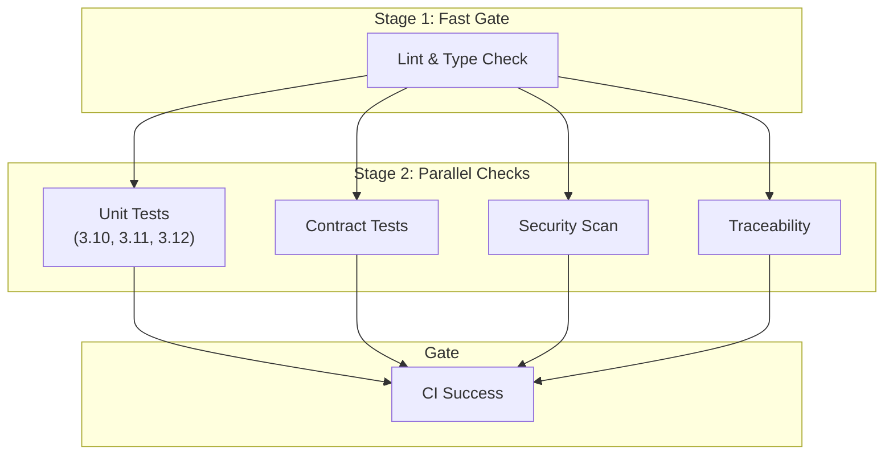
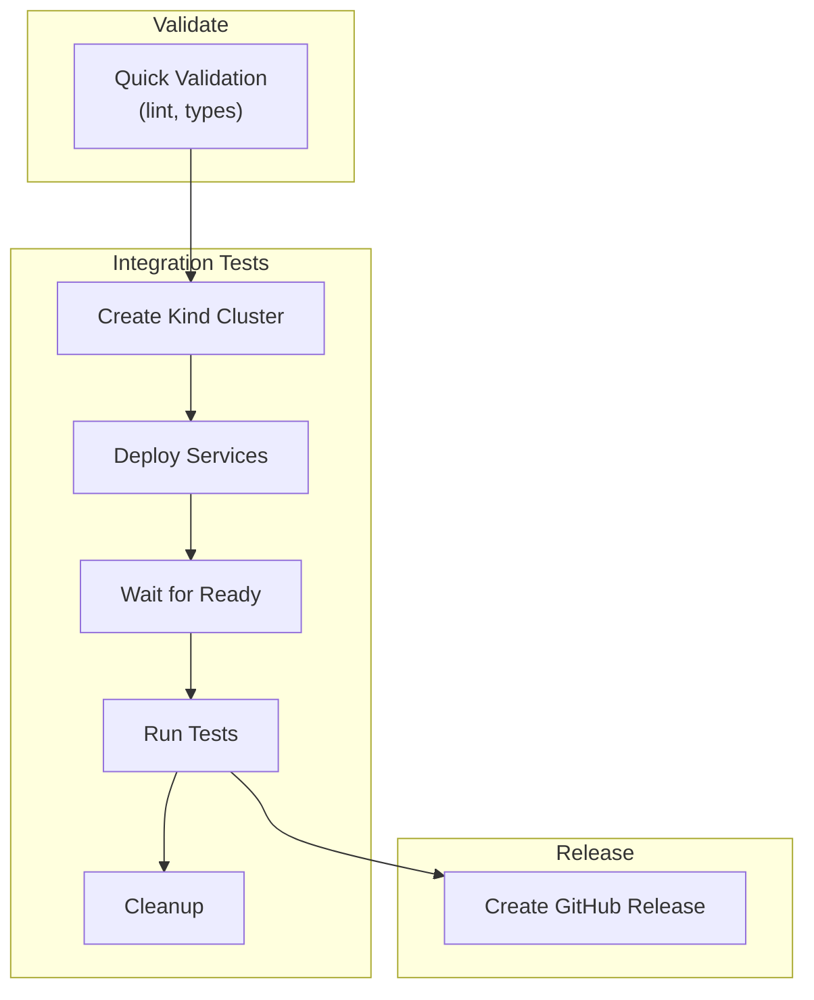

# CI/CD Pipelines

floe uses three GitHub Actions workflows optimized for speed and reliability.

---

## Quick Reference

| Trigger | Workflow | Duration | What Runs |
|---------|----------|----------|-----------|
| **PR / Push to main** | `ci.yml` | ~3 min | Lint, type check, unit tests, contract tests, security |
| **Tag v\*.\*.\*** | `release.yml` | ~15 min | Validate, integration tests (K8s), GitHub Release |
| **2am UTC Monday** | `weekly.yml` | ~10 min | Integration tests (K8s), dependency audit |

**Why this split?**
- PRs get fast feedback (~3 min) for quick iteration
- Integration tests (requiring K8s cluster) run on releases and weekly
- Dependency vulnerabilities are caught within a week

---

## PR Pipeline (`ci.yml`)

Fast checks that run on every PR and push to main.


```mermaid
flowchart TB
    subgraph LINT ["Stage 1: Fast Gate"]
        L["Lint & Type Check"]
    end

    subgraph PARALLEL ["Stage 2: Parallel Checks"]
        U["Unit Tests<br/>(3.10, 3.11, 3.12)"]
        C["Contract Tests"]
        S["Security Scan"]
        T["Traceability"]
    end

    subgraph GATE ["Gate"]
        SUCCESS["CI Success"]
    end

    L --> U
    L --> C
    L --> S
    L --> T
    U --> SUCCESS
    C --> SUCCESS
    S --> SUCCESS
    T --> SUCCESS
```

### Jobs

| Job | Purpose | Speed |
|-----|---------|-------|
| **lint-typecheck** | ruff + mypy --strict | ~30s |
| **security** | bandit + uv-secure | ~30s |
| **unit-tests** | pytest across Python versions | ~60s |
| **contract-tests** | Cross-package schema validation | ~20s |
| **traceability** | Requirement marker coverage | ~10s |

---

## Release Pipeline (`release.yml`)

Runs on version tags (e.g., `v0.1.0`) and validates before publishing.


```mermaid
flowchart TB
    subgraph VALIDATE ["Validate"]
        V["Quick Validation<br/>(lint, types)"]
    end

    subgraph K8S ["Integration Tests"]
        KIND["Create Kind Cluster"]
        DEPLOY["Deploy Services"]
        WAIT["Wait for Ready"]
        TEST["Run Tests"]
        CLEANUP["Cleanup"]
    end

    subgraph RELEASE ["Release"]
        GH["Create GitHub Release"]
    end

    V --> KIND
    KIND --> DEPLOY --> WAIT --> TEST --> CLEANUP
    TEST --> GH
```

### Triggering a Release

```bash
# Tag with semantic version
git tag v0.1.0
git push origin v0.1.0
```

The release workflow will:
1. Validate code (lint, type check)
2. Run integration tests in K8s (Kind cluster)
3. Create GitHub Release with auto-generated notes

---

## Weekly Pipeline (`weekly.yml`)

Scheduled at 2am UTC every Monday to catch regressions and vulnerabilities.

### Jobs

| Job | Purpose |
|-----|---------|
| **integration-tests** | Full integration test suite in K8s |
| **dependency-audit** | pip-audit for CVEs, stale dependency check |
| **build-cube-store** | Rebuild Cube Store image for supply chain pinning |
| **notify-failure** | Creates GitHub issue on failure |

### Manual Trigger

```bash
# Run weekly pipeline manually
gh workflow run weekly.yml
```

---

## Claude Workflows

The Claude workflows (`claude.yml` and `claude-code-review.yml`) use the same
Node 24-compatible pinned checkout action as the rest of CI:
`actions/checkout@de0fac2e4500dabe0009e67214ff5f5447ce83dd` (`v6.0.2`).

Anthropic app-token exchange validates that the workflow file exists on the
default branch and can fail while a PR is actively changing the Claude workflow
definition. Treat that as a workflow-identity rollout constraint, not evidence
that the checkout pin itself is invalid. Merge only after the normal required CI
checks are green; the Claude workflow identity is restored once the changed
workflow is on `main`.

---

## Local Development

### Install Git Hooks

```bash
# Install git hooks (pre-commit + Cognee) - run once after cloning
make setup-hooks
```

> **Note**: This installs hooks for pre-commit code quality checks and Cognee knowledge sync.
> It also sets a repo-local `core.hooksPath`, so these hooks still run if you use a
> global hooks manager elsewhere.
> Run again after `pre-commit install` to restore hooks.

### What Runs Locally

| Hook | When | Checks |
|------|------|--------|
| **Pre-commit** | `git commit` | ruff autofix, formatting, secrets, file hygiene, bandit, yaml |
| **Pre-push** | `git push` | ruff check, `ruff format --check`, mypy, dbt version validation, bandit, uv-secure, unit tests, contract tests, traceability |

### Reproduce CI Locally

```bash
# Full CI check
make check

# Or manually:
uv run ruff check .
uv run ruff format --check .
uv run mypy --strict packages/ testing/
uv run pytest packages/*/tests/unit/ -v
uv run pytest tests/contract/ -v
```

---

## Troubleshooting

### PR CI Failures

| Symptom | Fix |
|---------|-----|
| **ruff check failed** | `uv run ruff check --fix .` |
| **ruff format failed** | `uv run ruff format .` |
| **mypy failed** | Fix type errors shown in output |
| **Unit tests failed** | Run locally: `make test-unit` |
| **Contract tests failed** | Check `tests/contract/` for schema changes |

### Integration Test Failures

Integration tests run in K8s (Kind cluster). Common issues:

| Symptom | Cause | Fix |
|---------|-------|-----|
| Pod not ready | Service slow to start | Init containers wait for dependencies |
| Connection refused | Database not initialized | PostgreSQL init script needs time |
| Test timeout | Service crash loop | Check pod logs with `kubectl logs` |

### Weekly Failure

If the weekly build fails, a GitHub issue is created automatically with the `weekly-failure` label. Check the linked workflow run for details.

---

## Branch Protection

Required checks before merging to `main`:

| Check | Required | Description |
|-------|----------|-------------|
| **ci-success** | Yes | All PR CI jobs must pass |

### Quality Gates

| Metric | Requirement |
|--------|-------------|
| Unit Test Coverage | > 80% |

---

## Files Reference

| File | Purpose |
|------|---------|
| `.github/workflows/ci.yml` | PR/push pipeline |
| `.github/workflows/release.yml` | Release pipeline (on tags) |
| `.github/workflows/weekly.yml` | Scheduled tests + audit |
| `.pre-commit-config.yaml` | Local hooks |
| `testing/k8s/` | Kind cluster + service manifests |
| `testing/ci/` | CI test runner scripts |
