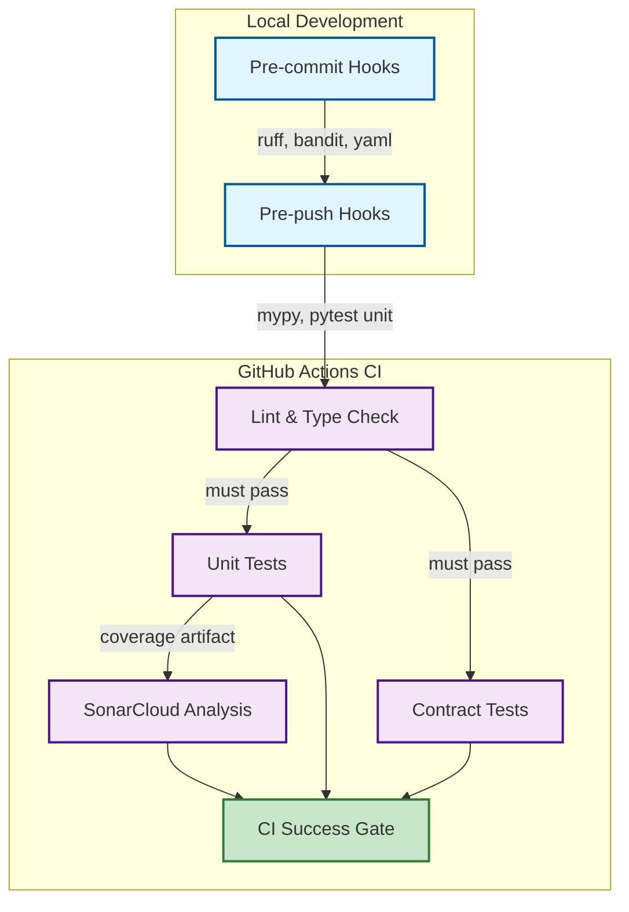
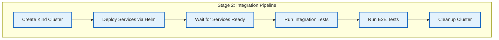

# CI/CD Strategy

This document outlines floe's continuous integration and deployment strategy, including local development hooks, GitHub Actions pipelines, and future expansion plans.

---

## Philosophy

**Catch 99% locally. CI is the safety net, not the first line of defense.**

Our CI strategy follows a progressive approach:
1. **Pre-commit hooks** catch formatting, linting, and obvious issues instantly
2. **Pre-push hooks** run type checking and fast unit tests before code leaves your machine
3. **CI pipeline** validates across Python versions and runs comprehensive checks
4. **Future stages** will add integration testing in Kubernetes

---

## Current Pipeline (Stage 1: Foundation)



### Local Hooks (Pre-commit)

Fast checks that run on every commit:

| Hook | Purpose | Speed |
|------|---------|-------|
| **ruff** | Linting + auto-fix | ~1s |
| **ruff-format** | Code formatting | ~1s |
| **bandit** | Security scanning | ~2s |
| **yaml/whitespace** | File hygiene | <1s |

### Local Hooks (Pre-push)

Thorough checks before code leaves your machine:

| Hook | Purpose | Speed |
|------|---------|-------|
| **mypy --strict** | Type checking | ~10s |
| **pytest unit** | Unit tests | ~30s |

### CI Pipeline Jobs

| Job | Python | Depends On | Purpose |
|-----|--------|------------|---------|
| **lint-typecheck** | 3.10 | - | Fast gate: ruff + mypy |
| **unit-tests** | 3.10, 3.11, 3.12 | lint-typecheck | Matrix testing with coverage |
| **contract-tests** | 3.10 | lint-typecheck | Cross-package contract validation |
| **sonarcloud** | - | unit-tests | Quality analysis + coverage |
| **ci-success** | - | all | Branch protection gate |

---

## Setup Instructions

### Install Pre-commit Hooks

```bash
# Install pre-commit and pre-push hooks
uv run pre-commit install
uv run pre-commit install --hook-type pre-push

# Run all hooks manually (useful for CI debugging)
uv run pre-commit run --all-files
```

### Local Development Workflow

```bash
# 1. Make changes to code
vim packages/floe-core/src/floe_core/plugin_registry.py

# 2. Stage changes (pre-commit runs automatically)
git add .

# 3. Commit (ruff, bandit, yaml checks run)
git commit -m "feat: add plugin validation"

# 4. Push (mypy + pytest run before push)
git push origin feature-branch
```

### Skip Hooks (Emergency Only)

```bash
# Skip pre-commit (not recommended)
git commit --no-verify -m "emergency fix"

# Skip pre-push (not recommended)
git push --no-verify origin feature-branch
```

---

## Future Stages

Our CI strategy will evolve through three stages:

```mermaid
flowchart LR
    subgraph S1 ["Stage 1: Foundation"]
        direction TB
        S1A["Lint & Type Check"]
        S1B["Unit Tests (matrix)"]
        S1C["Contract Tests"]
        S1D["SonarCloud"]
    end

    subgraph S2 ["Stage 2: Integration"]
        direction TB
        S2A["Kind Cluster Setup"]
        S2B["Service Deployment"]
        S2C["Integration Tests"]
        S2D["E2E Tests"]
    end

    subgraph S3 ["Stage 3: Release"]
        direction TB
        S3A["Semantic Versioning"]
        S3B["Package Publishing"]
        S3C["Helm Chart Release"]
        S3D["Documentation Deploy"]
    end

    S1 -->|"When integration tests exist"| S2
    S2 -->|"When ready for release"| S3

    classDef current fill:#c8e6c9,stroke:#2e7d32,stroke-width:3px
    classDef future fill:#fff3e0,stroke:#e65100,stroke-width:2px

    class S1,S1A,S1B,S1C,S1D current
    class S2,S2A,S2B,S2C,S2D,S3,S3A,S3B,S3C,S3D future
```



### Stage 2: Integration Testing (Planned)

When integration tests are added, CI will include:

- **Kind cluster provisioning** in GitHub Actions
- **Helm deployment** of test infrastructure (Polaris, LocalStack, PostgreSQL)
- **Integration test execution** against real services
- **E2E workflow validation** for complete pipelines



### Stage 3: Release Automation (Planned)

When ready for releases, CI will include:

- **Semantic versioning** based on conventional commits
- **PyPI publishing** for Python packages
- **Helm chart releases** to OCI registry
- **Documentation deployment** to GitHub Pages

---

## Branch Protection Rules

The following checks are required before merging to `main`:

| Check | Required | Description |
|-------|----------|-------------|
| **ci-success** | Yes | All CI jobs must pass |
| **SonarCloud Quality Gate** | Yes | No new bugs, vulnerabilities, or code smells |
| **Review approval** | Recommended | At least 1 approving review |

### Configuring Branch Protection

1. Go to **Settings > Branches > Branch protection rules**
2. Add rule for `main` branch
3. Enable:
   - Require status checks to pass before merging
   - Select `ci-success` as required check
   - Require branches to be up to date before merging

---

## Troubleshooting

### Pre-commit Hook Failures

```bash
# See what failed
uv run pre-commit run --all-files --verbose

# Fix ruff issues automatically
uv run ruff check --fix .
uv run ruff format .

# Fix mypy issues (manual)
uv run mypy --strict packages/
```

### CI Pipeline Failures

```bash
# Reproduce CI locally
uv sync --all-extras --dev
uv run ruff check .
uv run ruff format --check .
uv run mypy --strict packages/
uv run pytest packages/floe-core/tests/unit/ -v --cov=packages/floe-core/src
uv run pytest tests/contract/ -v
```

### SonarCloud Issues

SonarCloud analysis may fail if:
- Coverage drops below threshold
- New security vulnerabilities introduced
- Code smells exceed quality gate

Check the SonarCloud dashboard for details: [SonarCloud Project](https://sonarcloud.io/project/overview?id=Obsidian-Owl_floe)

---

## Quality Gates

### Coverage Requirements

| Test Type | Minimum Coverage |
|-----------|-----------------|
| Unit Tests | 80% |
| Integration Tests | 70% (future) |

### SonarCloud Quality Gate

| Metric | Requirement |
|--------|-------------|
| Security Rating | A (no vulnerabilities) |
| Reliability Rating | A (no bugs) |
| Maintainability Rating | A (manageable debt) |
| Coverage | > 80% on new code |
| Duplications | < 3% on new code |

---

## Files Reference

| File | Purpose |
|------|---------|
| `.github/workflows/ci.yml` | GitHub Actions CI pipeline |
| `.pre-commit-config.yaml` | Pre-commit and pre-push hooks |
| `pyproject.toml` | Tool configuration (ruff, mypy, pytest) |
| `sonar-project.properties` | SonarCloud configuration |
| `uv.lock` | Locked dependencies for reproducibility |
