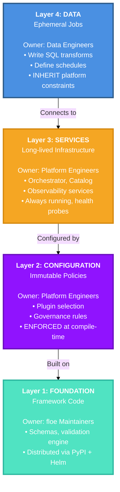
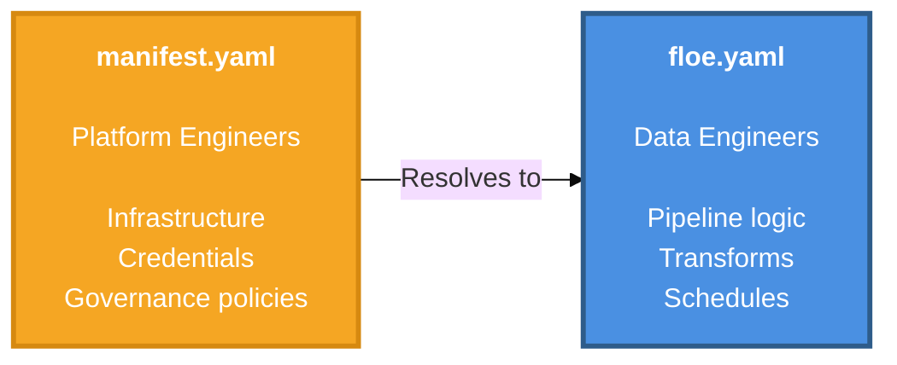

<div align="center">
  

  <h3>The Open Platform for building Data Platforms</h3>

  <p>
    <strong>Ship faster. Stay compliant. Scale to Data Mesh.</strong>
  </p>

  <p>
    <a href="LICENSE"></a>
    <a href="https://www.python.org/downloads/"></a>
    <a href="https://github.com/Obsidian-Owl/floe/releases"></a>
  </p>

  <p>
    <a href="#quick-start">Quick Start</a> •
    <a href="#features">Features</a> •
    <a href="#documentation">Documentation</a> •
    <a href="#contributing">Contributing</a>
  </p>
</div>

---

## What is floe?

**floe** is an open platform for building internal data platforms.

**Platform teams** choose their stack from 12 plugin types:
- **Compute:** DuckDB, Snowflake, Databricks, Spark, BigQuery
- **Orchestrator:** Dagster, Airflow 3.x
- **Catalog:** Polaris, AWS Glue, Unity Catalog
- **Observability:** Split into TelemetryBackend (Jaeger, Datadog) + LineageBackend (Marquez, Atlan)
- **[... 8 more plugin types]**

**Data teams** get opinionated workflows:
- ✅ 30 lines replaces 300+ lines of boilerplate
- ✅ Same config works everywhere (dev/staging/prod parity)
- ✅ Standards enforced automatically (compile-time validation)
- ✅ Full composability (swap DuckDB → Snowflake without pipeline changes)

**Batteries included. Fully customizable. Production-ready.**

---

### The Problem

**Platform engineers** supporting 50+ data teams face:
- **Integration hell**: Stitching together 15+ tools that don't talk to each other
- **Exception management**: Every team has a "unicorn use case" that breaks your framework
- **RBAC sprawl**: Managing 1200+ credentials across teams, environments, services
- **Security whack-a-mole**: Someone always finds a way to hardcode production secrets

**Data engineers** shipping data products face:
- **Governance theater**: 3 meetings to approve a pipeline ([64% struggle to embed governance in workflows](https://www.secoda.co/blog/data-governance-survey))
- **Platform dependency**: Blocked for 2 weeks because "platform team is busy" ([63% say leaders don't understand their pain](https://www.atlassian.com/blog/developer/developer-experience-report-2025))
- **Framework limitations**: Can't do what you need → shadow IT or 6-month wait
- **Unclear requirements**: "I thought 80% test coverage was optional?"

**Result**: Governance blocks teams instead of enabling them.

---

### The Solution

**For platform teams:**
- Get a **pre-integrated stack** (DuckDB + Dagster + Polaris + dbt tested together)
- Say "yes" to edge cases with **plugin architecture** (add Spark? Swap ComputePlugin. Need Kafka? Add IngestionPlugin)
- **Automatic credential vending** (SecretReference pattern, manage 1 OAuth config instead of 1200 secrets)
- **Enforce at compile-time** (violations caught before deployment, not in production)

**For data teams:**
- **Governance = automatic** (compile checks replace meetings)
- **Get capabilities instantly** (platform adds plugin, you use it immediately)
- **Escape hatches built-in** (plugin system extensible for your unicorn use case)
- **Requirements explicit** (minimum_test_coverage: 80 in manifest.yaml, not tribal knowledge)

**If it compiles, it's compliant.**

---

## How It Works

### 1. Platform Team Chooses Stack (Once)

**Composable architecture:** Mix and match from 13 plugin types

```yaml
# manifest.yaml (50 lines supports 200 pipelines)
compute:
  default: duckdb  # Or: snowflake, databricks, spark, bigquery
orchestrator: dagster  # Or: airflow
catalog: polaris       # Or: glue, unity-catalog

governance:
  naming_pattern: medallion        # bronze/silver/gold layers
  minimum_test_coverage: 80        # Explicit, not ambiguous
  block_on_failure: true           # Enforced, not suggested
```

### 2. Data Teams Write Business Logic (Always)

**Declarative config:** Same across all 50 teams

```yaml
# floe.yaml (30 lines replaces 300 lines of boilerplate)
name: customer-analytics
version: "0.1.0"

transforms:
  - type: dbt
    path: ./dbt
    models:
      - marts/mart_customer_orders.sql

schedule:
  cron: "0 6 * * *"
```

### 3. floe Generates Everything Else

**Compilation phase** (2 seconds, catches violations before deployment):

```bash
$ floe compile

[1/3] Loading platform policies
      ✓ Platform: acme-data-platform v1.2.3

[2/3] Validating pipeline
      ✓ Naming: bronze_customers (compliant)
      ✓ Test coverage: 85% (>80% required)

[3/3] Generating artifacts
      ✓ Dagster assets (Python)
      ✓ dbt profiles (YAML)
      ✓ Kubernetes manifests (YAML)
      ✓ Credentials (vended automatically)

Compilation SUCCESS - ready to deploy
```

**What's auto-generated:**
- ✅ Database connection configs (dbt profiles.yml)
- ✅ Orchestration code (Dagster assets or Airflow DAGs)
- ✅ Kubernetes manifests (Jobs, Services, ConfigMaps)
- ✅ Environment-specific settings (dev/staging/prod)
- ✅ Credential vending (SecretReference pattern, no hardcoded secrets)

**Same `floe.yaml` works across dev, staging, production.**

---

## Features

### 🔌 Composable by Design

**Choose from 12 plugin types.** Swap implementations without breaking pipelines.

**Example:** Start with DuckDB (local), scale to Snowflake (cloud):

```yaml
# Change ONE line in manifest.yaml
compute:
  default: snowflake  # Was: duckdb

# All 200 pipelines now run on Snowflake
# Zero pipeline code changes required
```

**Real-world swap scenarios:**
- DuckDB (local dev) → Snowflake (cloud prod)
- Dagster (asset-centric) → Airflow 3.x (DAG-based)
- Jaeger (local tracing) → Datadog (managed observability)

**Plugin types:** Compute, Orchestrator, Catalog, Storage, TelemetryBackend, LineageBackend, DBT, SemanticLayer, Ingestion, DataQuality, Secrets, Identity

### 📝 Declarative Configuration

**Two-tier YAML.** Platform team defines infrastructure. Data teams define logic.

**No code generation anxiety:** Compiled artifacts are checked into git. Diff them. Review them. Trust them.

### ✅ Compile-Time Validation

**Catch errors before deployment.** No runtime surprises.

**Example:**
```bash
$ floe compile
[FAIL] 'stg_payments' violates naming convention
       Expected: bronze_*, silver_*, gold_*

[FAIL] 'gold_revenue' missing required tests
       Required: [unique_pk, not_null_pk, documentation]

Compilation FAILED - fix violations before deployment
```

**Not documentation governance.** Computational governance.

### 🔐 Security by Default

**Layer boundaries enforce separation:**
- Credentials in platform config → Data teams **cannot access**
- Automatic vending with SecretReference → **No hardcoded secrets possible**
- Layer architecture → Data teams **cannot override** platform policies
- Type-safe schemas → Catch errors at **compile-time**

**Result:** Manage 1 OAuth config instead of 1200 credentials.

### ⚡ Environment Parity

**Same pipeline config works everywhere:**

| Environment | Platform Config | Pipeline Config |
|-------------|-----------------|-----------------|
| **Dev** | Local DuckDB | `floe.yaml` (no changes) |
| **Staging** | Shared Snowflake | `floe.yaml` (no changes) |
| **Prod** | Production Snowflake | `floe.yaml` (no changes) |

**Result:** No "works on my machine" issues. No config drift.

### 🌐 Data Mesh Ready

**Federated ownership with computational governance:**
- Enterprise policies → Domain constraints → Data products (three-tier hierarchy)
- Data contracts as code (ODCS standard, auto-validated)
- Compile-time + runtime enforcement (not meetings)
- Domain teams have autonomy within guardrails

**Scale from single platform to federated Data Mesh without rebuilding.**

---

## Quick Start

### Prerequisites

- **Python 3.10+**
- **Docker Desktop** or **OrbStack**
- **uv** package manager: `curl -LsSf https://astral.sh/uv/install.sh | sh`

### Installation

```bash
# Clone and install
git clone https://github.com/Obsidian-Owl/floe.git
cd floe
uv sync

# Deploy to local Kubernetes
make deploy-local-full

# Verify deployment
make demo-status
make show-urls  # Access Dagster UI
```

### Create Your First Pipeline

```yaml
# floe.yaml
name: customer-analytics
version: "0.1.0"

# Logical references (resolved by platform config)
storage: default
catalog: default
compute: default

transforms:
  - type: dbt
    path: ./dbt
    models:
      - marts/mart_customer_orders.sql

observability:
  traces: true
  lineage: true
```

Run validation:

```bash
floe compile  # Validates against platform policies
floe run      # Deploys to Kubernetes
```

---

## Architecture

### Four-Layer Enforcement Model



**Key principle**: Configuration flows downward only. Data teams cannot weaken platform policies.

### Two-Tier Configuration



| File | Audience | Contains |
|------|----------|----------|
| `manifest.yaml` | Platform Engineers | Infrastructure, credentials, governance policies |
| `floe.yaml` | Data Engineers | Pipeline logic, transforms, schedules |

**Benefit**: Data teams never see credentials or infrastructure details. Platform team controls standards centrally.

---

## Built on the Shoulders of Giants

floe provides **batteries-included OSS defaults** that run on any Kubernetes cluster:

- **[Apache Iceberg](https://iceberg.apache.org/)**: Open table format with ACID transactions
- **[Apache Polaris](https://polaris.apache.org/)**: Iceberg REST catalog
- **[DuckDB](https://duckdb.org/)**: High-performance analytics engine
- **[dbt](https://www.getdbt.com/)**: SQL transformation framework
- **[Dagster](https://dagster.io/)**: Asset-centric orchestration
- **[Cube](https://cube.dev/)**: Semantic layer and headless BI
- **[OpenTelemetry](https://opentelemetry.io/)** + **[OpenLineage](https://openlineage.io/)**: Observability and lineage standards

**Not "integration hell"**: Pre-configured, tested together, deployable with one command. Or swap any component for your cloud service of choice.

---

## Documentation

- **Getting Started**: [Quick Start Guide](docs/guides/00-overview.md)
- **Configuration**: [Configuration Contracts](docs/contracts/index.md) (manifest.yaml + floe.yaml)
- **Architecture**: [Four-Layer Model](docs/architecture/four-layer-overview.md) • [Platform Enforcement](docs/architecture/platform-enforcement.md)
- **Development**: [Contributing Guide](CONTRIBUTING.md) • [Code Standards](CLAUDE.md)
- **ADRs**: [Architecture Decision Records](docs/architecture/adr/index.md)

---

## Development

### Run Tests

```bash
make test-unit    # Fast unit tests (no infrastructure)
make test         # Integration tests (Docker Compose)
make test-k8s     # K8s-native tests (production parity)
```

### Code Quality

```bash
make check        # Run all quality checks (mirrors CI)
make lint         # Ruff linting + formatting
make typecheck    # mypy --strict
make format       # Auto-format code
```

### Local Deployment

```bash
make deploy-local-full  # Deploy complete stack
make show-urls          # Access services
make demo-e2e           # Run E2E validation
make demo-cleanup-full  # Cleanup
```

---

## Contributing

We welcome contributions! See [CONTRIBUTING.md](CONTRIBUTING.md) for guidelines.

### Development Setup

```bash
git clone https://github.com/Obsidian-Owl/floe.git
cd floe
uv sync
make hooks  # Install git hooks

# Run checks
make check
make test-all

# Submit PR
git checkout -b feature/your-feature
# Make changes
git commit -m "feat: your feature"
git push origin feature/your-feature
```

### Code Standards

- **Type safety**: All code must pass `mypy --strict`
- **Formatting**: Black (100 char), enforced by ruff
- **Testing**: >80% coverage, 100% requirement traceability
- **Security**: No hardcoded secrets, Pydantic validation
- **Architecture**: Respect layer boundaries

---

## Roadmap

**Current (v0.1.0 - Pre-Alpha)**:
- [x] Four-layer architecture
- [x] Two-tier configuration
- [x] Kubernetes-native deployment
- [x] Compile-time validation

**Next (v0.2.0 - Alpha)**:
- [ ] Complete K8s-native testing
- [ ] Plugin ecosystem docs
- [ ] CLI command suite
- [ ] External plugin support

**Future (v1.0.0 - Production)**:
- [ ] Data Mesh extensions
- [ ] OCI registry integration
- [ ] Multi-environment workflows

---

## License

Apache License 2.0 - See [LICENSE](LICENSE) for details.

---

## Community

- **Issues**: [GitHub Issues](https://github.com/Obsidian-Owl/floe/issues)
- **Discussions**: [GitHub Discussions](https://github.com/Obsidian-Owl/floe/discussions)

---

<div align="center">
  <sub>Built with ❤️ by the floe community</sub>
</div>
