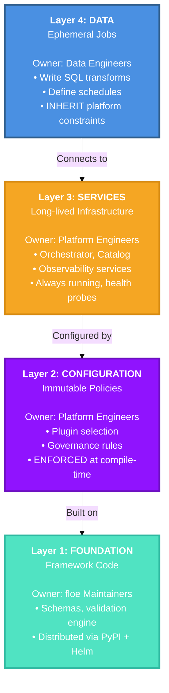
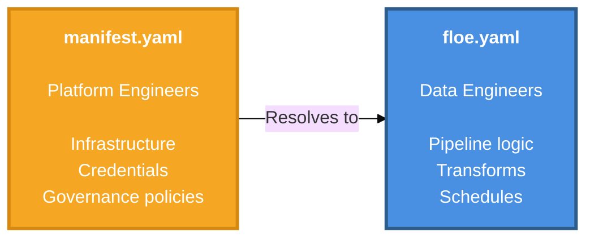

<div align="center">
  

  <h3>The Open Platform for building Data Platforms</h3>

  <p>
    <strong>Ship faster. Stay compliant. Build toward Data Mesh.</strong>
  </p>

  <p>
    <a href="LICENSE"></a>
    <a href="https://www.python.org/downloads/"></a>
    <a href="https://github.com/Obsidian-Owl/floe/releases"></a>
    <a href="https://deepwiki.com/Obsidian-Owl/floe"></a>
  </p>

  <p>
    <a href="#quick-start">Quick Start</a> •
    <a href="#features">Features</a> •
    <a href="#documentation">Documentation</a> •
    <a href="#contributing">Contributing</a>
  </p>
</div>

---

## What is floe?

**floe** is an open platform for building internal data platforms.

**Platform teams** choose their stack from 14 plugin categories:
- **Compute:** DuckDB, Snowflake, Databricks, Spark, BigQuery
- **Orchestrator:** Dagster, Airflow 3.x
- **Catalog:** Polaris, AWS Glue, Unity Catalog
- **Observability:** Split into TelemetryBackend (Jaeger, Datadog) + LineageBackend (Marquez, Atlan)
- **[... 10 more plugin categories]**

**Data teams** get opinionated workflows:
- ✅ 30 lines replaces 300+ lines of boilerplate
- ✅ Same config works everywhere (dev/staging/prod parity)
- ✅ Standards enforced automatically (compile-time validation)
- ✅ Full composability (swap DuckDB → Snowflake without pipeline changes)

**Batteries included. Fully customizable. Alpha-ready for the documented Customer 360 validation path.**

---

### The Problem

**Platform engineers** supporting 50+ data teams face:
- **Integration hell**: Stitching together 15+ tools that don't talk to each other
- **Exception management**: Every team has a "unicorn use case" that breaks your framework
- **RBAC sprawl**: Managing 1200+ credentials across teams, environments, services
- **Security whack-a-mole**: Someone always finds a way to hardcode production secrets

**Data engineers** shipping data products face:
- **Governance theater**: 3 meetings to approve a pipeline ([64% struggle to embed governance in workflows](https://www.secoda.co/blog/data-governance-survey))
- **Platform dependency**: Blocked for 2 weeks because "platform team is busy" ([63% say leaders don't understand their pain](https://www.atlassian.com/blog/developer/developer-experience-report-2025))
- **Framework limitations**: Can't do what you need → shadow IT or 6-month wait
- **Unclear requirements**: "I thought 80% test coverage was optional?"

**Result**: Governance blocks teams instead of enabling them.

---

### The Solution

**For platform teams:**
- Get a **pre-integrated stack** (DuckDB + Dagster + Polaris + dbt tested together)
- Say "yes" to edge cases with **plugin architecture** (add Spark? Swap ComputePlugin. Need Kafka? Add IngestionPlugin)
- **Automatic credential vending** (SecretReference pattern, manage 1 OAuth config instead of 1200 secrets)
- **Enforce at compile-time** (violations caught before deployment, not in production)

**For data teams:**
- **Governance = automatic** (compile checks replace meetings)
- **Get capabilities instantly** (platform adds plugin, you use it immediately)
- **Escape hatches built-in** (plugin system extensible for your unicorn use case)
- **Requirements explicit** (minimum_test_coverage: 80 in manifest.yaml, not tribal knowledge)

**If it compiles, it's compliant.**

---

## How It Works

### 1. Platform Team Chooses Stack (Once)

**Composable architecture:** Mix and match from 14 plugin categories

```yaml
# manifest.yaml (50 lines supports 200 pipelines)
compute:
  approved:
    - name: duckdb      # Cost-effective analytics
    - name: spark       # Heavy processing
    - name: snowflake   # Enterprise warehouse
  default: duckdb       # Used when transform doesn't specify
orchestrator: dagster   # Or: airflow
catalog: polaris        # Or: glue, unity-catalog

governance:
  naming_pattern: medallion        # bronze/silver/gold layers
  minimum_test_coverage: 80        # Explicit, not ambiguous
  block_on_failure: true           # Enforced, not suggested
```

### 2. Data Teams Write Business Logic (Always)

**Declarative config:** Same across all 50 teams. Select compute per-step from approved list.

```yaml
# floe.yaml (30 lines replaces 300 lines of boilerplate)
name: customer-analytics
version: "0.1.0"

transforms:
  - type: dbt
    path: ./dbt/staging
    compute: spark      # Heavy processing on Spark

  - type: dbt
    path: ./dbt/marts
    compute: duckdb     # Analytics on DuckDB

schedule:
  cron: "0 6 * * *"
```

### 3. floe Generates Everything Else

**Current alpha compilation path** (generates Customer 360 demo artifacts for inspection):

```bash
make compile-demo

[1/3] Loading demo platform manifest
      ✓ Platform: Customer 360 alpha path

[2/3] Running platform compiler
      ✓ uv run floe platform compile

[3/3] Writing generated artifacts
      ✓ Dagster assets (Python)
      ✓ dbt profiles (YAML)
      ✓ Floe compiled artifacts (JSON)

Demo compilation SUCCESS - artifacts ready to inspect
```

The root data-team compile command is a planned lifecycle entry point and is not the current alpha workflow.

**What's auto-generated:**
- ✅ Database connection configs (dbt profiles.yml)
- ✅ Orchestration code (Dagster assets or Airflow DAGs)
- ✅ Kubernetes manifests (Jobs, Services, ConfigMaps)
- ✅ Environment-specific settings (dev/staging/prod)
- ✅ Credential vending (SecretReference pattern, no hardcoded secrets)

**Same `floe.yaml` works across dev, staging, production.**

---

## Features

### 🔌 Composable by Design

**Choose from 14 plugin categories.** Swap implementations without breaking pipelines.

**Multi-compute pipelines:** Platform teams approve N compute targets. Data engineers select per-step from the approved list. Different steps can use different engines:

```yaml
# manifest.yaml (Platform Team)
compute:
  approved:
    - name: spark       # Heavy processing
    - name: duckdb      # Cost-effective analytics
    - name: snowflake   # Enterprise warehouse
  default: duckdb

# floe.yaml (Data Engineers)
transforms:
  - type: dbt
    path: models/staging/
    compute: spark      # Process 10TB raw data

  - type: dbt
    path: models/marts/
    compute: duckdb     # Build metrics on 100GB result
```

**Environment parity preserved:** Each step uses the SAME compute across dev/staging/prod. No "works in dev, fails in prod" surprises.

**Real-world swap scenarios:**
- DuckDB (embedded, cost-effective) ↔ Snowflake (managed, elastic)
- Dagster (asset-centric) ↔ Airflow 3.x (DAG-based)
- Jaeger (self-hosted) ↔ Datadog (managed SaaS)

**Plugin categories:** Compute, Orchestrator, Catalog, Storage, TelemetryBackend, LineageBackend, DBT, SemanticLayer, Ingestion, Quality, RBAC, AlertChannel, Secrets, Identity

### 📝 Declarative Configuration

**Two-tier YAML.** Platform team defines infrastructure. Data teams define logic.

**No code generation anxiety:** Compiled artifacts are checked into git. Diff them. Review them. Trust them.

### ✅ Compile-Time Validation

**Catch errors before deployment.** No runtime surprises.

**Example:**
```bash
make compile-demo

[FAIL] Customer 360 artifact validation failed
       Evidence key: storage.customer_360_outputs

Fix the demo platform or data-product inputs, then re-run the alpha validator.
```

**Not documentation governance.** Computational governance.

### 🔐 Security by Default

**Layer boundaries enforce separation:**
- Credentials in platform config → Data teams **cannot access**
- Automatic vending with SecretReference → **No hardcoded secrets possible**
- Layer architecture → Data teams **cannot override** platform policies
- Type-safe schemas → Catch errors at **compile-time**

**Result:** Manage 1 OAuth config instead of 1200 credentials.

### ⚡ Environment Parity

**Same pipeline config works everywhere:**

| Environment | Platform Config | Pipeline Config |
|-------------|-----------------|-----------------|
| **Dev** | DuckDB (local cluster) | `floe.yaml` (no changes) |
| **Staging** | DuckDB (shared cluster) | `floe.yaml` (no changes) |
| **Prod** | DuckDB (production cluster) | `floe.yaml` (no changes) |

Or swap to Snowflake, Databricks, or Spark—the pipeline config stays identical.

**Result:** No "works on my machine" issues. No config drift. What you test is what you deploy.

### 🌐 Data Mesh Direction

**Federated ownership with computational governance:**
- Enterprise policies → Domain constraints → Data products (three-tier hierarchy)
- Data contracts as code (ODCS standard, auto-validated)
- Compile-time + runtime enforcement (not meetings)
- Domain teams have autonomy within guardrails

The current alpha exposes the primitives and current state documented in [Capability Status](docs/architecture/capability-status.md). Multi-cluster operational hardening and validated federated Data Mesh operations remain planned, not alpha-proven.

---

## Architecture

### Four-Layer Enforcement Model


```mermaid
%%{init: {'theme':'base', 'themeVariables': { 'fontSize':'16px'}}}%%
flowchart TB
    L4["<b>Layer 4: DATA</b><br/>Ephemeral Jobs<br/><br/>Owner: Data Engineers<br/>• Write SQL transforms<br/>• Define schedules<br/>• INHERIT platform constraints"]

    L3["<b>Layer 3: SERVICES</b><br/>Long-lived Infrastructure<br/><br/>Owner: Platform Engineers<br/>• Orchestrator, Catalog<br/>• Observability services<br/>• Always running, health probes"]

    L2["<b>Layer 2: CONFIGURATION</b><br/>Immutable Policies<br/><br/>Owner: Platform Engineers<br/>• Plugin selection<br/>• Governance rules<br/>• ENFORCED at compile-time"]

    L1["<b>Layer 1: FOUNDATION</b><br/>Framework Code<br/><br/>Owner: floe Maintainers<br/>• Schemas, validation engine<br/>• Distributed via PyPI + Helm"]

    L4 -->|Connects to| L3
    L3 -->|Configured by| L2
    L2 -->|Built on| L1

    classDef dataLayer fill:#4A90E2,stroke:#2E5C8A,stroke-width:3px,color:#fff
    classDef serviceLayer fill:#F5A623,stroke:#D68910,stroke-width:3px,color:#fff
    classDef configLayer fill:#9013FE,stroke:#6B0FBF,stroke-width:3px,color:#fff
    classDef foundationLayer fill:#50E3C2,stroke:#2EB8A0,stroke-width:3px,color:#fff

    class L4 dataLayer
    class L3 serviceLayer
    class L2 configLayer
    class L1 foundationLayer
```

**Key principle**: Configuration flows downward only. Data teams cannot weaken platform policies.

### Two-Tier Configuration


```mermaid
%%{init: {'theme':'base', 'themeVariables': { 'fontSize':'16px'}}}%%
flowchart LR
    PM["<b>manifest.yaml</b><br/><br/>Platform Engineers<br/><br/>Infrastructure<br/>Credentials<br/>Governance policies"]

    FL["<b>floe.yaml</b><br/><br/>Data Engineers<br/><br/>Pipeline logic<br/>Transforms<br/>Schedules"]

    PM -->|Resolves to| FL

    classDef platformConfig fill:#F5A623,stroke:#D68910,stroke-width:3px,color:#fff
    classDef dataConfig fill:#4A90E2,stroke:#2E5C8A,stroke-width:3px,color:#fff

    class PM platformConfig
    class FL dataConfig
```

| File | Audience | Contains |
|------|----------|----------|
| `manifest.yaml` | Platform Engineers | Infrastructure, credentials, governance policies |
| `floe.yaml` | Data Engineers | Pipeline logic, transforms, schedules |

**Benefit**: Data teams never see credentials or infrastructure details. Platform team controls standards centrally.

---

## Built on the Shoulders of Giants

floe provides **batteries-included OSS defaults** that run on any Kubernetes cluster:

- **[Apache Iceberg](https://iceberg.apache.org/)**: Open table format with ACID transactions
- **[Apache Polaris](https://polaris.apache.org/)**: Iceberg REST catalog
- **[DuckDB](https://duckdb.org/)**: High-performance analytics engine
- **[dbt](https://www.getdbt.com/)**: SQL transformation framework
- **[Dagster](https://dagster.io/)**: Asset-centric orchestration
- **[Cube](https://cube.dev/)**: Semantic layer and headless BI
- **[OpenTelemetry](https://opentelemetry.io/)** + **[OpenLineage](https://openlineage.io/)**: Observability and lineage standards

**Not "integration hell"**: Pre-configured, tested together, deployable with one command. Or swap any component for your cloud service of choice.

---

## Documentation

The alpha documentation site is built from `docs/` with Astro Starlight:

```bash
make docs-build
make docs-serve
```

Start with [Start Here](docs/start-here/index.md).

- **Platform Engineers**: [Deploy Your First Platform](docs/platform-engineers/first-platform.md) • [Validate Your Platform](docs/platform-engineers/validate-platform.md)
- **Data Engineers**: [Build Your First Data Product](docs/data-engineers/first-data-product.md) • [Validate Your Data Product](docs/data-engineers/validate-data-product.md)
- **Configuration**: [Reference Index](docs/reference/index.md) • [floe.yaml Schema](docs/reference/floe-yaml-schema.md) • [Compiled Artifacts](docs/contracts/compiled-artifacts.md)
- **Architecture**: [Four-Layer Model](docs/architecture/four-layer-overview.md) • [Capability Status](docs/architecture/capability-status.md)
- **Development**: [Contributing Guide](CONTRIBUTING.md) • [Floe Contributor Docs](docs/contributing/index.md)
- **ADRs**: [Architecture Decision Records](docs/architecture/adr/index.md)

---

## Contributing

We welcome contributions! See [CONTRIBUTING.md](CONTRIBUTING.md) for guidelines.


### Code Standards

- **Type safety**: All code must pass `mypy --strict`
- **Formatting**: Black (100 char), enforced by ruff
- **Testing**: >80% coverage, 100% requirement traceability
- **Security**: No hardcoded secrets, Pydantic validation
- **Architecture**: Respect layer boundaries

---

## Roadmap

**Current alpha target (v0.1.0-alpha.1 release candidate)**:
- [x] Four-layer architecture
- [x] Two-tier configuration
- [x] Kubernetes-native deployment
- [x] Customer 360 demo artifact compilation and validation path

**Next candidate work**:
- [ ] Complete K8s-native testing
- [ ] Plugin ecosystem docs
- [ ] Data-team CLI command suite
- [ ] External plugin support

**Future production hardening**:
- [ ] Data Mesh extensions
- [ ] OCI registry integration
- [ ] Multi-environment workflows

---

## License

Apache License 2.0 - See [LICENSE](LICENSE) for details.

---

## Community

- **Issues**: [GitHub Issues](https://github.com/Obsidian-Owl/floe/issues)
- **Discussions**: [GitHub Discussions](https://github.com/Obsidian-Owl/floe/discussions)

---

<div align="center">
  <sub>Built with ❤️ by the floe community</sub>
</div>
