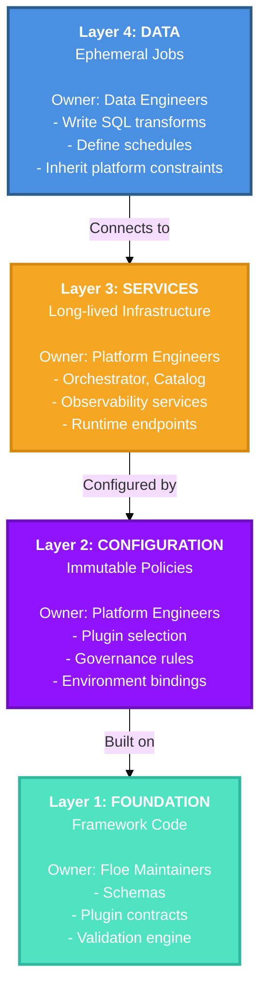

<div align="center">
  

  <h3>The open platform for building internal data platforms</h3>

  <p>
    <strong>Ship faster. Preserve governance. Build toward Data Mesh.</strong>
  </p>

  <p>
    <a href="LICENSE"></a>
    <a href="https://www.python.org/downloads/"></a>
    <a href="https://github.com/Obsidian-Owl/floe/releases"></a>
    <a href="https://deepwiki.com/Obsidian-Owl/floe"></a>
  </p>

  <p>
    <a href="#quick-start">Quick Start</a> •
    <a href="#alpha-scope">Alpha Scope</a> •
    <a href="#vision">Vision</a> •
    <a href="#features">Features</a> •
    <a href="#documentation">Documentation</a> •
    <a href="#contributing">Contributing</a>
  </p>
</div>

---

## Alpha Release Notice

`v0.1.0-alpha.1` is an evaluation release for the documented Customer 360
validation path and the manifest-declared alpha package cutline. APIs,
configuration schemas, Helm values, generated artifacts, and plugin contracts
may change before a stable release.

Do not run Floe alpha releases with production data, production credentials,
regulated workloads, customer-facing SLAs, or production-scale loads. Use
isolated test accounts, synthetic or disposable data, scoped credentials,
separate Kubernetes clusters/namespaces, and explicit cost limits when
evaluating the platform.

Floe is distributed under the Apache License 2.0 on an "AS IS" basis, without
warranties or conditions. See [LICENSE](LICENSE) for the full license terms.

## What Is Floe?

Floe is an open platform for building internal data platforms.

The long-term goal is a composable platform where platform teams define
governed infrastructure standards once, and data teams ship data products using
clear, repeatable workflows. Floe is designed around:

- **Four-layer separation:** foundation code, platform configuration, runtime
  services, and data workloads have different owners.
- **Two-file configuration:** `manifest.yaml` defines platform-owned standards;
  `floe.yaml` defines data-product intent.
- **Typed plugin contracts:** providers integrate behind capabilities,
  requirements, bindings, and resolver validation.
- **Secret-free artifacts:** compiled contracts carry references and deployment
  bindings, not raw credentials.
- **Data Mesh direction:** domains can own data products within platform-defined
  guardrails as the operational model matures.

The alpha release proves a narrow, high-confidence path through that model. It
does not claim every provider, plugin category, or self-service deployment
workflow is production-ready.

## Quick Start

### Install Alpha Packages

Install the core alpha package from PyPI:

```bash
python -m pip install "floe-core==0.1.0a1"
```

Install the main published alpha runtime surface:

```bash
python -m pip install \
  "floe-core==0.1.0a1" \
  "floe-iceberg==0.1.0a1" \
  "floe-orchestrator-dagster==0.1.0a1" \
  "floe-catalog-polaris==0.1.0a1" \
  "floe-storage-minio==0.1.0a1" \
  "floe-compute-duckdb==0.1.0a1" \
  "floe-dbt-core==0.1.0a1" \
  "floe-ingestion-dlt==0.1.0a1" \
  "floe-telemetry-jaeger==0.1.0a1" \
  "floe-lineage-marquez==0.1.0a1" \
  "floe-quality-gx==0.1.0a1" \
  "floe-rbac-k8s==0.1.0a1" \
  "floe-network-security-k8s==0.1.0a1"
```

AWS provider compatibility packages are also published for live validation
against isolated AWS test infrastructure:

```bash
python -m pip install \
  "floe-storage-aws-s3==0.1.0a1" \
  "floe-catalog-glue==0.1.0a1"
```

The complete publish/exclude cutline is in
[release/floe-release.yaml](release/floe-release.yaml).

### Run The Source-Checkout Alpha Path

The current demo, charts, and contributor validation scripts are repository
workflows, not a packaged one-command product installer:

```bash
git clone https://github.com/Obsidian-Owl/floe.git
cd floe
git checkout v0.1.0-alpha.1
uv sync --all-extras --dev

make compile-demo
make docs-build
```

For the full Customer 360 release-validation path, start with
[Customer 360 Golden Demo](docs/demo/customer-360.md). Contributor remote E2E
validation uses DevPod + Hetzner and is intentionally separate from normal
package installation.

## Alpha Scope

### Alpha-Supported Today

- Customer 360 demo compilation and validation.
- Single-platform Kubernetes deployment using the `floe-platform` Helm chart.
- Manifest-driven platform and data-product configuration for the documented
  alpha path.
- Dagster-centered runtime artifact generation for the documented alpha path.
- OpenTelemetry and OpenLineage evidence through Jaeger and Marquez.
- MinIO/S3-compatible storage in the demo path.
- Live AWS S3 + Glue provider compatibility validation in isolated test
  infrastructure.
- The 15 Python packages declared in `release/floe-release.yaml`.

### Implemented Primitives

These pieces exist in code, schema, or chart form, but do not yet imply a full
supported user workflow:

- Data Mesh schema and contract primitives.
- Manifest inheritance and namespace strategy fields.
- `charts/floe-jobs` for lower-level Kubernetes Job and CronJob rendering.
- Semantic-layer primitives such as Cube, which is charted but disabled by
  default in the Customer 360 alpha gate.
- Identity, secrets, alerts, additional quality, and alternative dbt runtime
  plugin primitives that are excluded from the alpha publish set.

### Not Alpha-Supported

- Production data platform operation.
- Production availability, backup, recovery, migration, or support guarantees.
- Planned self-service product registration command `floe product register`.
- Planned self-service product execution command `floe run`.
- Planned self-service product deployment command `floe product deploy`.
- Multi-cluster Data Mesh operations.
- Provider swaps unless the corresponding plugin and composition contract have
  been implemented, published, documented, and validated for the target path.

See [Capability Status](docs/architecture/capability-status.md) and the
[Plugin Catalog](docs/reference/plugin-catalog.md) for the current source of
truth.

## Vision

Platform teams should be able to offer an internal data platform that feels
boring in the right ways: clear standards, explicit approvals, repeatable
runtime environments, and enough plugin flexibility to avoid bespoke platform
forks for every team.

Data teams should be able to describe the product they want to build without
owning every infrastructure detail. Floe's direction is to turn that intent into
validated artifacts: dbt profiles, orchestration definitions, deployment
bindings, lineage and telemetry configuration, policy evidence, and runtime
handoff material.

The end state is a governed, composable platform that can scale from one
internal platform to federated Data Mesh operations. The alpha is the first
release gate on that path, not the finish line.

## How It Works

### 1. Platform Team Chooses Standards

Platform-owned `manifest.yaml` selects approved plugins and governance rules:

```yaml
compute:
  approved:
    - name: duckdb
  default: duckdb

orchestrator: dagster
catalog: polaris
storage: minio

governance:
  naming_pattern: medallion
  minimum_test_coverage: 80
  block_on_failure: true
```

Floe has 14 plugin categories: Compute, Orchestrator, Catalog, Storage,
TelemetryBackend, LineageBackend, DBT, SemanticLayer, Ingestion, Quality, RBAC,
AlertChannel, Secrets, and Identity.

### 2. Data Teams Describe Product Intent

Data-team `floe.yaml` describes pipeline intent and uses platform-approved
capabilities:

```yaml
name: customer-analytics
version: "0.1.0"

transforms:
  - type: dbt
    path: ./dbt/staging
    compute: duckdb

schedule:
  cron: "0 6 * * *"
```

### 3. Floe Compiles Reviewable Runtime Artifacts

The alpha compilation path generates artifacts for the documented runtime path:

```bash
make compile-demo
```

Generated outputs include:

- dbt profile configuration.
- Dagster runtime definitions for the alpha path.
- Floe compiled artifacts as JSON.
- Credential references and resolved deployment bindings.

Compiled artifacts are intended to be reviewable and diffable. Raw secrets must
remain outside `CompiledArtifacts`.

## Features

### Composable By Design

Floe's plugin model is designed so providers integrate behind contracts rather
than by reaching into each other's implementation details. Capabilities,
requirements, typed bindings, and resolver validation own cross-plugin
contracts.

Provider examples:

- DuckDB is the alpha compute reference implementation; Snowflake, Spark,
  Databricks, and BigQuery are future/provider implementation examples.
- Dagster is the alpha orchestrator reference implementation; Airflow remains a
  planned/provider path.
- Polaris and AWS Glue are catalog paths with current alpha evidence in their
  respective validation surfaces.
- MinIO/S3-compatible storage and AWS S3 are the current alpha storage paths.

### Declarative Configuration

The platform/data split keeps data-product intent separate from platform-owned
infrastructure bindings:

| File | Audience | Contains |
| --- | --- | --- |
| `manifest.yaml` | Platform Engineers | Infrastructure, credentials, plugin selection, governance policies |
| `floe.yaml` | Data Engineers | Product logic, transforms, schedules, approved capability selections |

### Validation Before Runtime

Floe validates configured policies and composition contracts before runtime
handoff. This reduces late failures, but it is not a universal compliance
guarantee. Organizations still own production controls, audits, data
classification, access review, and operational approval.

### Security Boundaries

- Platform-owned credentials remain outside data-product config.
- Deployment bindings resolve infrastructure details for renderers.
- Helm/renderers consume resolved bindings instead of rediscovering plugin
  configuration.
- Compiled artifacts must remain secret-free.

### Data Mesh Direction

Floe's architecture includes primitives for federated ownership with
computational governance:

- Enterprise policies, domain constraints, and data-product contracts.
- Data contracts as code.
- Compile-time and runtime evidence.
- Domain autonomy within platform guardrails.

The current alpha exposes the primitives documented in
[Capability Status](docs/architecture/capability-status.md). Multi-cluster
operational hardening and validated federated Data Mesh operations remain
planned.

## Architecture

### Four-Layer Enforcement Model


```mermaid
%%{init: {'theme':'base', 'themeVariables': { 'fontSize':'16px'}}}%%
flowchart TB
    L4["<b>Layer 4: DATA</b><br/>Ephemeral Jobs<br/><br/>Owner: Data Engineers<br/>- Write SQL transforms<br/>- Define schedules<br/>- Inherit platform constraints"]

    L3["<b>Layer 3: SERVICES</b><br/>Long-lived Infrastructure<br/><br/>Owner: Platform Engineers<br/>- Orchestrator, Catalog<br/>- Observability services<br/>- Runtime endpoints"]

    L2["<b>Layer 2: CONFIGURATION</b><br/>Immutable Policies<br/><br/>Owner: Platform Engineers<br/>- Plugin selection<br/>- Governance rules<br/>- Environment bindings"]

    L1["<b>Layer 1: FOUNDATION</b><br/>Framework Code<br/><br/>Owner: Floe Maintainers<br/>- Schemas<br/>- Plugin contracts<br/>- Validation engine"]

    L4 -->|Connects to| L3
    L3 -->|Configured by| L2
    L2 -->|Built on| L1

    classDef dataLayer fill:#4A90E2,stroke:#2E5C8A,stroke-width:3px,color:#fff
    classDef serviceLayer fill:#F5A623,stroke:#D68910,stroke-width:3px,color:#fff
    classDef configLayer fill:#9013FE,stroke:#6B0FBF,stroke-width:3px,color:#fff
    classDef foundationLayer fill:#50E3C2,stroke:#2EB8A0,stroke-width:3px,color:#fff

    class L4 dataLayer
    class L3 serviceLayer
    class L2 configLayer
    class L1 foundationLayer
```

Configuration flows downward. Data workloads consume approved platform
capabilities; they do not weaken platform policies.

## Built On Open Standards

Floe integrates with established open-source projects and standards:

- [Apache Iceberg](https://iceberg.apache.org/) for table format semantics.
- [Apache Polaris](https://polaris.apache.org/) for Iceberg REST catalog
  integration.
- [DuckDB](https://duckdb.org/) for the alpha compute reference path.
- [dbt](https://www.getdbt.com/) for SQL transformation workflows.
- [Dagster](https://dagster.io/) for the alpha orchestration reference path.
- [OpenTelemetry](https://opentelemetry.io/) and
  [OpenLineage](https://openlineage.io/) for trace and lineage evidence.

Cube and other ecosystem integrations remain important to the platform vision,
but they should be read through the alpha scope above.

## Documentation

The documentation site is built from `docs/` with Astro Starlight:

```bash
make docs-build
make docs-serve
```

Start with [Start Here](docs/start-here/index.md).

- **Alpha release:** [Release Notes](docs/releases/v0.1.0-alpha.1-release-notes.md) • [Release Checklist](docs/releases/v0.1.0-alpha.1-checklist.md)
- **Platform Engineers:** [Deploy Your First Platform](docs/platform-engineers/first-platform.md) • [Validate Your Platform](docs/platform-engineers/validate-platform.md)
- **Data Engineers:** [Build Your First Data Product](docs/data-engineers/first-data-product.md) • [Validate Your Data Product](docs/data-engineers/validate-data-product.md)
- **Demo:** [Customer 360 Golden Demo](docs/demo/customer-360.md)
- **Configuration:** [Reference Index](docs/reference/index.md) • [floe.yaml Schema](docs/reference/floe-yaml-schema.md) • [Compiled Artifacts](docs/contracts/compiled-artifacts.md)
- **Architecture:** [Four-Layer Model](docs/architecture/four-layer-overview.md) • [Capability Status](docs/architecture/capability-status.md) • [Plugin Catalog](docs/reference/plugin-catalog.md)
- **Development:** [Contributing Guide](CONTRIBUTING.md) • [Floe Contributor Docs](docs/contributing/index.md)
- **ADRs:** [Architecture Decision Records](docs/architecture/adr/index.md)

## Contributing

See [CONTRIBUTING.md](CONTRIBUTING.md) for contributor setup and workflow.

Code standards:

- Type safety: `mypy --strict`.
- Formatting and linting: Ruff.
- Testing: focused unit/contract tests locally; integration, E2E, and live
  provider validation on their documented release lanes.
- Security: no hardcoded secrets, no raw credentials in compiled artifacts.
- Architecture: respect layer and plugin-contract boundaries.

## Roadmap

**Current alpha release (`v0.1.0-alpha.1`):**

- [x] Four-layer architecture.
- [x] Two-tier configuration.
- [x] Manifest-declared package cutline.
- [x] Kubernetes-native Customer 360 validation path.
- [x] Live AWS S3 + Glue provider compatibility validation.

**Next candidate work:**

- [ ] Improve packaged product lifecycle commands.
- [ ] Expand plugin ecosystem documentation and compatibility ledgers.
- [ ] Harden provider-specific managed Kubernetes guides after validation.
- [ ] Continue integration and E2E coverage uplift on weekly/release lanes.

**Future production hardening:**

- [ ] Federated Data Mesh operations.
- [ ] OCI registry integration for platform configuration artifacts.
- [ ] Multi-environment production workflows.
- [ ] Stable public contracts and upgrade policy.

## License

Apache License 2.0 - See [LICENSE](LICENSE) for details.

## Community

- **Issues:** [GitHub Issues](https://github.com/Obsidian-Owl/floe/issues)
- **Discussions:** [GitHub Discussions](https://github.com/Obsidian-Owl/floe/discussions)

---

<div align="center">
  <sub>Built by the Floe community.</sub>
</div>
