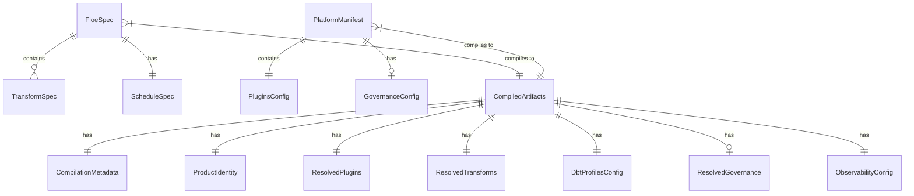

# Data Model: Compilation Pipeline

**Branch**: `2b-compilation-pipeline` | **Date**: 2026-01-14 | **Spec**: [spec.md](./spec.md)

## Entity Overview



## Input Entities

### FloeSpec (NEW)

Data engineer's configuration from `floe.yaml`. Defines a single data product.

**Location**: `packages/floe-core/src/floe_core/schemas/floe_spec.py`

| Field | Type | Required | Description |
|-------|------|----------|-------------|
| api_version | `Literal["floe.dev/v1"]` | Yes | API version for schema compatibility |
| kind | `Literal["FloeSpec"]` | Yes | Resource kind discriminator |
| metadata | `FloeMetadata` | Yes | Product metadata (name, version, owner) |
| platform | `PlatformRef` | No | Reference to platform manifest (OCI URI) |
| transforms | `list[TransformSpec]` | Yes | List of dbt models/transforms |
| schedule | `ScheduleSpec` | No | Optional scheduling configuration |

**Constraints**:
- C001: metadata.name must match `^[a-z][a-z0-9-]*$` (DNS-compatible)
- C002: metadata.version must be valid semver
- C003: transforms must have at least one entry
- C004: No environment-specific fields allowed (FR-014)

```python
class FloeSpec(BaseModel):
    """Data product configuration from floe.yaml."""
    model_config = ConfigDict(frozen=True, extra="forbid")

    api_version: Literal["floe.dev/v1"] = Field(alias="apiVersion")
    kind: Literal["FloeSpec"]
    metadata: FloeMetadata
    platform: PlatformRef | None = None
    transforms: list[TransformSpec]
    schedule: ScheduleSpec | None = None
```

### FloeMetadata (NEW)

Metadata for a FloeSpec data product.

| Field | Type | Required | Description |
|-------|------|----------|-------------|
| name | `str` | Yes | Product name (DNS-compatible) |
| version | `str` | Yes | Product version (semver) |
| description | `str` | No | Human-readable description |
| owner | `str` | No | Owner email or team name |
| labels | `dict[str, str]` | No | Key-value labels for categorization |

### TransformSpec (NEW)

Configuration for a single dbt model/transform.

| Field | Type | Required | Description |
|-------|------|----------|-------------|
| name | `str` | Yes | Model name (must exist in dbt project) |
| compute | `str` | No | Compute target override (None = platform default) |
| tags | `list[str]` | No | dbt tags for selection |
| depends_on | `list[str]` | No | Explicit dependencies (model names) |

**Constraints**:
- C005: name must match dbt model naming convention `^[a-zA-Z_][a-zA-Z0-9_]*$`
- C006: compute must be in platform's approved_plugins list (if specified)

### ScheduleSpec (NEW)

Scheduling configuration for the data product.

| Field | Type | Required | Description |
|-------|------|----------|-------------|
| cron | `str` | No | Cron expression (e.g., "0 6 * * *") |
| timezone | `str` | No | IANA timezone (default: UTC) |
| enabled | `bool` | No | Whether schedule is active (default: true) |

### PlatformRef (NEW)

Reference to a platform manifest.

| Field | Type | Required | Description |
|-------|------|----------|-------------|
| manifest | `str` | Yes | OCI URI or local path to manifest |

## Output Entities

### CompiledArtifacts (EXTENDED)

**Location**: `packages/floe-core/src/floe_core/schemas/compiled_artifacts.py`

The sole contract between floe-core and downstream packages. Frozen (immutable) after creation.

**Existing Fields** (from Epic 1):
| Field | Type | Description |
|-------|------|-------------|
| version | `str` | Schema version (semver) |
| metadata | `CompilationMetadata` | Compilation info |
| identity | `ProductIdentity` | Product identity from catalog |
| mode | `DeploymentMode` | simple, centralized, mesh |
| inheritance_chain | `list[ManifestRef]` | Manifest lineage |
| observability | `ObservabilityConfig` | Telemetry + lineage config |

**New Fields** (Epic 2B):
| Field | Type | Required | Description |
|-------|------|----------|-------------|
| plugins | `ResolvedPlugins` | Yes | Resolved plugin configuration |
| transforms | `ResolvedTransforms` | Yes | Compiled transform configuration |
| dbt_profiles | `dict[str, Any]` | Yes | Generated profiles.yml content |
| governance | `ResolvedGovernance` | No | Resolved governance settings |

**Version Change**: 0.1.0 → 0.2.0 (MINOR - additive fields only)

### ResolvedPlugins (NEW)

Resolved plugin selections after inheritance.

| Field | Type | Required | Description |
|-------|------|----------|-------------|
| compute | `PluginRef` | Yes | Resolved compute plugin |
| orchestrator | `PluginRef` | Yes | Resolved orchestrator plugin |
| catalog | `PluginRef` | No | Resolved catalog plugin |
| storage | `PluginRef` | No | Resolved storage plugin |
| ingestion | `PluginRef` | No | Resolved ingestion plugin |
| semantic | `PluginRef` | No | Resolved semantic layer plugin |

### PluginRef (NEW)

Reference to a resolved plugin.

| Field | Type | Required | Description |
|-------|------|----------|-------------|
| type | `str` | Yes | Plugin type name (e.g., "duckdb") |
| version | `str` | Yes | Plugin version |
| config | `dict[str, Any]` | No | Plugin-specific configuration |

### ResolvedTransforms (NEW)

Compiled transform configuration.

| Field | Type | Required | Description |
|-------|------|----------|-------------|
| models | `list[ResolvedModel]` | Yes | List of resolved models |
| default_compute | `str` | Yes | Default compute target |

### ResolvedModel (NEW)

A transform model with resolved compute target.

| Field | Type | Required | Description |
|-------|------|----------|-------------|
| name | `str` | Yes | Model name |
| compute | `str` | Yes | Resolved compute target (never None) |
| tags | `list[str]` | No | dbt tags |
| depends_on | `list[str]` | No | Dependencies |

### ResolvedGovernance (NEW)

Governance settings after inheritance resolution.

| Field | Type | Required | Description |
|-------|------|----------|-------------|
| pii_encryption | `Literal["required", "optional"]` | No | PII encryption policy |
| audit_logging | `Literal["enabled", "disabled"]` | No | Audit logging policy |
| policy_enforcement_level | `Literal["off", "warn", "strict"]` | No | Enforcement level |
| data_retention_days | `int` | No | Retention period |

## Compilation Stage Entities

### CompilationStage (NEW)

Enumeration of pipeline stages.

**Location**: `packages/floe-core/src/floe_core/compilation/stages.py`

```python
class CompilationStage(str, Enum):
    """Compilation pipeline stages (FR-001)."""
    LOAD = "load"           # Load floe.yaml and manifest.yaml
    VALIDATE = "validate"   # Validate schemas
    RESOLVE = "resolve"     # Resolve inheritance and plugins
    ENFORCE = "enforce"     # Apply policy enforcement
    COMPILE = "compile"     # Generate dbt profiles, compute resolution
    GENERATE = "generate"   # Write CompiledArtifacts
```

### CompilationContext (NEW)

Context passed through compilation stages.

| Field | Type | Required | Description |
|-------|------|----------|-------------|
| floe_spec | `FloeSpec` | Yes | Loaded FloeSpec |
| manifest | `PlatformManifest` | Yes | Loaded PlatformManifest |
| resolved_plugins | `ResolvedPlugins` | No | After RESOLVE stage |
| resolved_transforms | `ResolvedTransforms` | No | After COMPILE stage |
| dbt_profiles | `dict[str, Any]` | No | After COMPILE stage |
| errors | `list[CompilationError]` | No | Accumulated errors |
| warnings | `list[str]` | No | Accumulated warnings |

### CompilationError (NEW)

Structured error with remediation guidance (FR-002, SC-002).

| Field | Type | Required | Description |
|-------|------|----------|-------------|
| stage | `CompilationStage` | Yes | Stage where error occurred |
| code | `str` | Yes | Error code (e.g., "E001") |
| message | `str` | Yes | Human-readable message |
| file | `str` | No | File path if applicable |
| line | `int` | No | Line number if applicable |
| suggestion | `str` | Yes | Actionable fix suggestion |
| docs_link | `str` | No | Link to documentation |

## Serialization Methods

### CompiledArtifacts Methods

```python
class CompiledArtifacts(BaseModel):
    # Existing fields...

    def to_json_file(self, path: Path) -> None:
        """Serialize to JSON file (FR-004)."""

    @classmethod
    def from_json_file(cls, path: Path) -> CompiledArtifacts:
        """Deserialize from JSON file (FR-004)."""

    def to_yaml_file(self, path: Path) -> None:
        """Serialize to YAML file (FR-011)."""

    @classmethod
    def from_yaml_file(cls, path: Path) -> CompiledArtifacts:
        """Deserialize from YAML file (FR-011)."""
```

## Validation Rules Summary

| Code | Entity | Rule |
|------|--------|------|
| C001 | FloeSpec | metadata.name must be DNS-compatible |
| C002 | FloeSpec | metadata.version must be valid semver |
| C003 | FloeSpec | transforms must have at least one entry |
| C004 | FloeSpec | No environment-specific fields (FR-014) |
| C005 | TransformSpec | name must match dbt model naming convention |
| C006 | TransformSpec | compute must be in approved_plugins (if specified) |
| C007 | CompiledArtifacts | Immutable after creation (frozen=True) |
| C008 | CompiledArtifacts | Round-trip serialization preserves all fields |

## Contract Versioning

| Version | Change Type | Description |
|---------|-------------|-------------|
| 0.1.0 | Initial | metadata, identity, mode, inheritance_chain, observability |
| 0.2.0 | MINOR | Add plugins, transforms, dbt_profiles, governance |

**Backward Compatibility**: 0.2.0 can read 0.1.0 artifacts (new fields have defaults).
